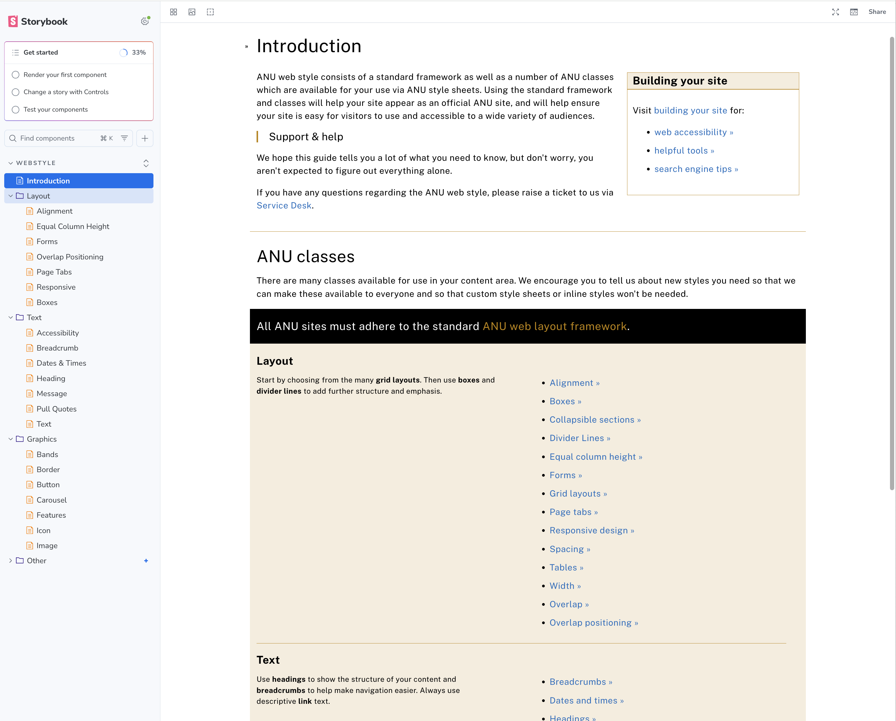

This is a demo Storybook project showcasing the **ANU WebStyle** CSS library:

- **WEBSTYLE**:
  - Storybook documentation for ANU CSS classes from the WebStyle library
    - https://github.com/anu-its/sew-websites-webstyle
    - https://webpublishing.anu.edu.au/web-style-guide
  - organised into three categories:
    - **Layout** — Alignment, Boxes, Equal Column Height, Forms, Overlap Positioning, Page Tabs, Responsive
    - **Text** — Accessibility, Breadcrumb, Dates & Times, Heading, Message, Pull Quotes, Text
    - **Graphics** — Bands, Border, Button, Carousel, Features, Icon, Image
  - using:
    - SASS / SCSS (`components/WebStyle/lib/sew-websites-webstyle/styles/scss/`)
    - MDX Documentation (`components/WebStyle/**/*.mdx`)

You can run the project via running the following:

-   `npm install && npm run storybook`

Last preview on Chromatic (main-branch):

- [https://main--6ab7c3e4a4089b10a20fdae4.chromatic.com/](https://main--6ab7c3e4a4089b10a20fdae4.chromatic.com/)

